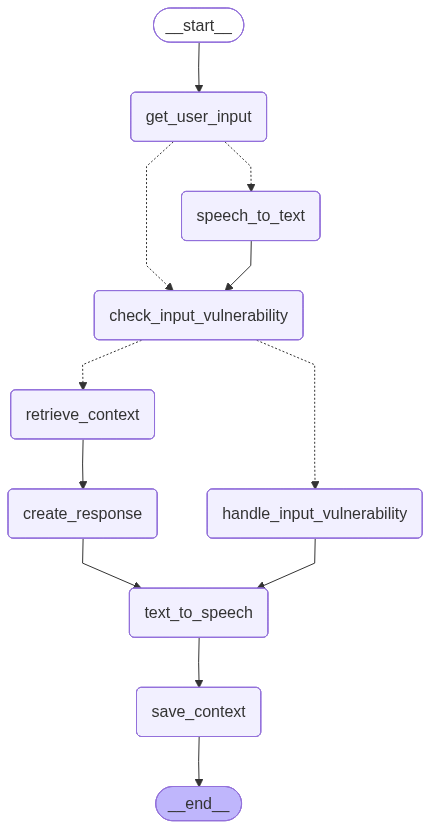

# 🎓 AI Tutor

An intelligent, voice-enabled AI tutoring system built on **LangGraph** that combines Retrieval-Augmented Generation (RAG), multi-layer safety guardrails, semantic caching, and real-time sentence-level streaming with Text-to-Speech synthesis.

<!-- TODO: Add a hero banner / screenshot here -->


---

## Table of Contents

- [Overview](#overview)
- [Key Features](#key-features)
- [System Architecture](#system-architecture)
  - [High-Level Pipeline](#high-level-pipeline)
  - [LangGraph State Machine](#langgraph-state-machine)
  - [Graph Visualization](#graph-visualization)
- [Technology Stack](#technology-stack)
- [Project Structure](#project-structure)
- [Core Components](#core-components)
  - [1. Voice Activity Detection (Silero VAD)](#1-voice-activity-detection-silero-vad)
  - [2. Speech-to-Text (faster-whisper)](#2-speech-to-text-faster-whisper)
  - [3. Text-to-Speech (Kokoro TTS)](#3-text-to-speech-kokoro-tts)
  - [4. Embeddings (BGE-M3)](#4-embeddings-bge-m3)
  - [5. Re-Ranker (BGE-Reranker-v2-m3)](#5-re-ranker-bge-reranker-v2-m3)
  - [6. Safety Guard (Llama Guard 3)](#6-safety-guard-llama-guard-3)
  - [7. Core LLM (Google Gemini)](#7-core-llm-google-gemini)
  - [8. Vector Store (Qdrant)](#8-vector-store-qdrant)
  - [9. Semantic Cache (Redis)](#9-semantic-cache-redis)
  - [10. Conversation Memory (Redis)](#10-conversation-memory-redis)
- [Pipeline Detail](#pipeline-detail)
  - [Batched Pipeline](#batched-pipeline)
  - [Streaming Pipeline](#streaming-pipeline)
  - [Safety Regeneration Loop](#safety-regeneration-loop)
  - [Performance Optimizations](#performance-optimizations)
- [API Reference](#api-reference)
  - [Chat Endpoints](#chat-endpoints)
  - [Session Endpoints](#session-endpoints)
  - [SSE Event Types (Streaming)](#sse-event-types-streaming)
- [Document Ingestion](#document-ingestion)
- [Getting Started](#getting-started)
  - [Prerequisites](#prerequisites)
  - [Installation](#installation)
  - [Environment Configuration](#environment-configuration)
  - [Running the Server](#running-the-server)
  - [CLI Mode](#cli-mode)
- [Configuration Reference](#configuration-reference)
- [License](#license)

---

## Overview

AI Tutor is a full-stack conversational tutoring system designed to help students learn through natural dialogue — via text or voice. It retrieves relevant knowledge from an ingested document corpus, generates pedagogically-oriented responses with a large language model, and optionally reads the answer aloud using neural TTS.

The system is designed around a **LangGraph state machine** that orchestrates a multi-step pipeline: input processing → safety filtering → context retrieval → response generation → output safety → speech synthesis. Every step is asynchronous and several steps run in parallel to minimise end-to-end latency.

---

## Key Features

| Category | Feature |
|---|---|
| **Multi-Modal Input** | Accepts both text and voice (WAV audio) input |
| **RAG Pipeline** | Retrieves and re-ranks relevant passages from a Qdrant vector store |
| **Dual Safety Guardrails** | Input *and* output are screened by Llama Guard 3 with an automatic regeneration loop |
| **Semantic Caching** | Redis-backed vector similarity cache skips the entire LLM pipeline on near-duplicate questions (saves 800–1500 ms) |
| **Conversation Memory** | Per-session rolling history, LLM-generated summaries, and entity extraction stored in Redis |
| **Query Reformulation** | Short or pronoun-heavy queries are automatically rewritten for better retrieval |
| **Sentence-Level Streaming** | SSE endpoint streams text + audio sentence-by-sentence; TTS runs concurrently with LLM token generation |
| **Speculative TTS** | On the batched path, TTS runs *in parallel* with the output safety check — audio is ready instantly when the (safe) verdict arrives |
| **Session Management** | Full CRUD for named sessions with 30-day TTL |
| **CLI & Server** | Interactive CLI for development; production-ready FastAPI server |

---

## System Architecture

### High-Level Pipeline

```
┌─────────────────────────────────────────────────────────────────────────┐
│                           USER INPUT                                    │
│                     (text query  OR  WAV audio)                         │
└──────────────────────────────┬──────────────────────────────────────────┘
                               │
                               ▼
                    ┌─────────────────────┐
                    │   get_user_input     │  Assign session/user IDs
                    └──────────┬──────────┘
                               │
                    ┌──────────▼──────────┐
             ┌──────│  route_after_input  │──────┐
             │      └─────────────────────┘      │
        voice│                              text │
             ▼                                   ▼
   ┌──────────────────┐              ┌───────────────────────────┐
   │  speech_to_text   │              │ check_input_vulnerability │
   │  (VAD + Whisper)  │─────────────▶│    (Llama Guard 3)        │
   └──────────────────┘              └─────────────┬─────────────┘
                                                   │
                                      ┌────────────▼────────────┐
                               unsafe │  route_after_input_     │ safe
                              ┌───────│       safety            │───────┐
                              │       └─────────────────────────┘       │
                              ▼                                         ▼
               ┌──────────────────────────┐              ┌──────────────────────┐
               │ handle_input_vulnerability│              │  retrieve_context     │
               │   (safe fallback msg)     │              │  (cache → reformulate │
               └─────────────┬────────────┘              │   → embed → Qdrant   │
                             │                           │   → re-rank)          │
                             │                           └──────────┬───────────┘
                             │                                      │
                             │                         ┌────────────▼────────────┐
                             │                  cache  │  route_after_retrieve   │ miss
                             │                  hit ┌──│                         │──┐
                             │                      │  └─────────────────────────┘  │
                             │                      │                               ▼
                             │                      │                ┌───────────────────────┐
                             │                      │                │    create_response     │
                             │                      │                │  (Core LLM — Gemini)   │
                             │                      │                └───────────┬───────────┘
                             │                      │                            │
                             │                      ▼                            ▼
                             │              ┌────────────────────────────────────────┐
                             │              │      check_output_vulnerability        │
                             │              │  (Llama Guard 3  ‖  Speculative TTS)   │
                             │              └────────────────────┬───────────────────┘
                             │                                   │
                             │                      ┌────────────▼────────────┐
                             │               unsafe │  route_after_output_   │ safe
                             │              ┌───────│       safety           │───────┐
                             │              │       └────────────────────────┘       │
                             │              ▼                                        ▼
                             │  ┌───────────────────────────┐           ┌────────────────────┐
                             │  │ handle_output_vulnerability│           │   text_to_speech    │
                             │  │   (regen loop or fallback) │           │  (Kokoro / Zalo)    │
                             │  └───────────┬───────────────┘           └────────┬───────────┘
                             │              │  ↻ loop back to                    │
                             │              │    create_response                 │
                             │              │    (up to MAX_REGENERATIONS)       │
                             │                                                  │
                             └──────────────────────────────────────────────────▶│
                                                                                ▼
                                                                          ┌───────────┐
                                                                          │    END     │
                                                                          └───────────┘
                                                                 (background: save_context)
```

### LangGraph State Machine

The pipeline is implemented as a compiled `StateGraph` in [`graph.py`](graph.py). Each box in the diagram above is a **node** (an async function defined in [`nodes.py`](nodes.py)). Routing between nodes is handled by **conditional edges** — pure functions that inspect the current `State` dict and return the name of the next node.

The `State` type is defined in [`state.py`](state.py) as a `TypedDict` with ~25 fields covering every stage of the pipeline (input audio, transcript, safety verdicts, retrieved passages, LLM response, output audio, etc.).

### Graph Visualization

The LangGraph state machine is automatically exported as a PNG image when the graph module is imported.

<!-- TODO: Add the tutor_graph.png image here -->


<!--  -->

---

## Technology Stack

| Layer | Technology | Purpose |
|---|---|---|
| **Orchestration** | [LangGraph](https://github.com/langchain-ai/langgraph) ≥ 0.2 | State machine graph for pipeline orchestration |
| **Core LLM** | [Google Gemini](https://ai.google.dev/) via `langchain-google-genai` | Main response generation & query reformulation |
| **Safety LLM** | [Llama Guard 3 1B](https://huggingface.co/meta-llama/Llama-Guard-3-1B) via [Ollama](https://ollama.com/) | Input & output content moderation |
| **Embeddings** | [BGE-M3](https://huggingface.co/BAAI/bge-m3) via `FlagEmbedding` | Dense 1024-dim multilingual embeddings |
| **Re-Ranker** | [BGE-Reranker-v2-m3](https://huggingface.co/BAAI/bge-reranker-v2-m3) via `sentence-transformers` | Cross-encoder passage re-ranking |
| **Vector DB** | [Qdrant](https://qdrant.tech/) (local mode) | Dense vector similarity search |
| **Cache & Memory** | [Redis](https://redis.io/) ≥ 5.0 | Semantic cache + conversation history/summaries/entities |
| **STT** | [faster-whisper](https://github.com/SYSTRAN/faster-whisper) | Local speech-to-text (CTranslate2 backend) |
| **VAD** | [Silero VAD](https://github.com/snakers4/silero-vad) | Voice activity detection before transcription |
| **TTS** | [Kokoro](https://github.com/hexgrad/kokoro) | Neural text-to-speech synthesis |
| **Server** | [FastAPI](https://fastapi.tiangolo.com/) + [Uvicorn](https://www.uvicorn.org/) | HTTP API with SSE streaming support |
| **Ingestion** | `pypdf`, `python-docx`, `unstructured`, `markdown` | Multi-format document parsing |

---

## Project Structure

```
AI tutor/
├── config.py             # Centralised configuration (dataclass + env vars)
├── state.py              # LangGraph State TypedDict definition
├── graph.py              # LangGraph StateGraph construction & compilation
├── nodes.py              # All graph node functions + routing logic
├── services.py           # Service layer (VAD, STT, TTS, LLM, Qdrant, Redis, etc.)
├── server.py             # FastAPI server (batched + streaming endpoints)
├── main.py               # CLI entry point (interactive REPL + one-shot modes)
├── ingestion/            # Document ingestion pipeline
│   └── notebookf60d4efa7c.ipynb  # Ingestion notebook
├── requirements.txt      # Python dependencies
├── .env.example          # Environment variable template
├── .gitignore
├── tutor_graph.png       # Auto-generated graph visualization
├── qdrant_db/            # Local Qdrant storage (gitignored)
└── frontend/             # Frontend application (see separate docs)
```

---

## Core Components

All services are implemented in [`services.py`](services.py) as singleton classes instantiated via `@lru_cache(maxsize=1)` factory functions. This ensures each heavy model (Whisper, BGE-M3, Kokoro, etc.) is loaded exactly once.

### 1. Voice Activity Detection (Silero VAD)

**Class:** `VADService`  
**Model:** `snakers4/silero-vad` (loaded from `torch.hub`)

Detects whether an audio clip contains human speech before running the more expensive Whisper transcription. Configurable via:

| Parameter | Default | Description |
|---|---|---|
| `VAD_THRESHOLD` | `0.5` | Speech probability threshold |
| `VAD_SAMPLE_RATE` | `16000` | Expected audio sample rate (Hz) |
| `VAD_MIN_SPEECH_DURATION_MS` | `250` | Minimum speech segment duration |

**Key Methods:**
- `detect_from_path(wav_path)` — file-based detection (preferred; avoids redundant disk writes)
- `detect(audio_bytes)` — legacy bytes-based entry point

---

### 2. Speech-to-Text (faster-whisper)

**Class:** `STTService`  
**Model:** Configurable via `WHISPER_MODEL` (default: `base`)

Uses [CTranslate2](https://github.com/OpenNMT/CTranslate2)-optimised Whisper for fast local transcription. Supports `int8` quantisation on CPU and `float16` on CUDA.

| Parameter | Default | Description |
|---|---|---|
| `WHISPER_MODEL` | `base` | Model size: `tiny`, `base`, `small`, `medium`, `large-v3` |
| `WHISPER_LANGUAGE` | `vi` | Target language code (Vietnamese default) |
| `WHISPER_DEVICE` | `cpu` | Compute device (`cpu` or `cuda`) |

**Key Methods:**
- `transcribe_from_path(wav_path) → (text, confidence)` — path-based (shares temp file with VAD)
- `transcribe(audio_bytes) → (text, confidence)` — legacy bytes-based entry point

---

### 3. Text-to-Speech (Kokoro TTS)

**Class:** `TTSService`  
**Backend:** Configurable — `kokoro` (default), `zalo`, or `viettts`

Converts LLM text responses into WAV audio. The Kokoro backend runs a local neural TTS pipeline; Zalo is API-based.

| Parameter | Default | Description |
|---|---|---|
| `TTS_BACKEND` | `kokoro` | TTS engine selection |
| `KOKORO_LANG_CODE` | `a` | Language code (`a` = English, `z` = Chinese, etc.) |
| `KOKORO_VOICE` | `af_heart` | Voice preset |
| `KOKORO_SPEED` | `1.4` | Speech rate multiplier |
| `TTS_SAMPLE_RATE` | `24000` | Output audio sample rate (Hz) |

**Key Methods:**
- `synthesize(text) → bytes` — full text synthesis (async, runs in thread pool)
- `synthesize_sentence(sentence) → bytes` — alias for sentence-level streaming

---

### 4. Embeddings (BGE-M3)

**Class:** `EmbedderService`  
**Model:** `BAAI/bge-m3` via `FlagEmbedding`

Produces dense 1024-dimensional, L2-normalised embeddings. Supports multilingual text. Used for both document indexing (at ingestion time) and query embedding (at query time).

| Parameter | Default | Description |
|---|---|---|
| `EMBEDDING_MODEL` | `BAAI/bge-m3` | HuggingFace model name |
| `EMBEDDING_DEVICE` | `cpu` | Compute device |
| `EMBEDDING_BATCH_SIZE` | `12` | Batch size for encoding |

**Key Methods:**
- `embed(texts) → np.ndarray` — batch embedding (N × 1024)
- `embed_query(text) → np.ndarray` — single-query convenience method

---

### 5. Re-Ranker (BGE-Reranker-v2-m3)

**Class:** `RerankerService`  
**Model:** `BAAI/bge-reranker-v2-m3` via `sentence-transformers` `CrossEncoder`

A cross-encoder re-ranker that rescores (query, passage) pairs and returns the top-k passages sorted by relevance. Applied after initial Qdrant retrieval to improve precision.

| Parameter | Default | Description |
|---|---|---|
| `RERANKER_MODEL` | `BAAI/bge-reranker-v2-m3` | HuggingFace model name |
| `RERANKER_DEVICE` | `cpu` | Compute device |
| `TOP_K_RETRIEVE` | `10` | Passages fetched from Qdrant |
| `TOP_K_RERANK` | `3` | Passages kept after re-ranking |

**Key Methods:**
- `rerank(query, passages, top_k) → (passages, scores)` — returns sorted top-k

---

### 6. Safety Guard (Llama Guard 3)

**Class:** `SafetyService`  
**Model:** `llama-guard3:1b` via local [Ollama](https://ollama.com/) API

Screens both user input and LLM output for unsafe content across 8 categories:

| Code | Category |
|---|---|
| S1 | Violence and Hate |
| S2 | Sexual Content |
| S3 | Criminal Planning |
| S4 | Weapons |
| S5 | Self-Harm |
| S6 | Regulated or Controlled Substances |
| S7 | Suicide & Self-Harm |
| S8 | Graphic Content |

**Key Methods:**
- `check(text, role="User") → (is_safe: bool, category: str)` — async safety check via Ollama `/api/generate`

If the Ollama service is unreachable, the check defaults to **safe** to avoid blocking the entire pipeline.

---

### 7. Core LLM (Google Gemini)

**Class:** `LLMService`  
**Model:** Configurable via `CORE_LLM_MODEL` (default: `gemma3:1b-it-qat`)

Uses `ChatGoogleGenerativeAI` from `langchain-google-genai`. Client instances are cached by `(model, temperature, max_tokens)` to avoid re-initialising the HTTP transport on every call.

| Parameter | Default | Description |
|---|---|---|
| `CORE_LLM_MODEL` | `gemma3:1b-it-qat` | Main generation model |
| `REFORMULATION_MODEL` | `gemma3:270m` | Lightweight model for query rewriting & summarisation |
| `LLM_TEMPERATURE` | `0.7` | Sampling temperature |
| `LLM_MAX_TOKENS` | `2048` | Maximum output tokens |

**Key Methods:**
- `chat(messages, ...) → str` — batched completion (async)
- `stream_chat(messages, ...) → AsyncGenerator[str]` — token-level streaming (async generator)
- `reformulate_query(query, history, entities) → str` — rewrites ambiguous queries for better retrieval

---

### 8. Vector Store (Qdrant)

**Class:** `VectorStoreService`  
**Backend:** Qdrant in **local/embedded mode** (`QdrantClient(path=...)`)

Stores and retrieves document chunks as dense vectors. Uses a cosine similarity search with a score threshold of `0.7`.

| Parameter | Default | Description |
|---|---|---|
| `QDRANT_PATH` | `./qdrant_db` | Local storage directory |
| `QDRANT_COLLECTION` | `ai_tutor_docs` | Collection name |
| `QDRANT_VECTOR_SIZE` | `1024` | Vector dimensionality (must match BGE-M3) |

**Key Methods:**
- `search(query_vec, top_k) → (passages, sources)` — returns text passages and source document names

---

### 9. Semantic Cache (Redis)

**Class:** `SemanticCacheService`  
**Backend:** Redis (single key holding a JSON list of `{query, response, vec}` entries)

On a cache **hit**, the entire LLM pipeline is short-circuited: no query reformulation, no Qdrant search, no re-ranking, no core LLM call — saving **800–1500 ms** per turn.

| Parameter | Value | Description |
|---|---|---|
| `SIMILARITY_THRESHOLD` | `0.92` | Cosine similarity threshold for a hit |
| `MAX_ENTRIES` | `500` | Maximum cached entries (FIFO eviction) |
| `TTL` | `7 days` | Redis key expiration |

**How it works:**
1. The raw user query is embedded with BGE-M3.
2. The embedding is compared (dot product = cosine, since BGE-M3 vectors are L2-normalised) against all cached vectors.
3. If the best match exceeds `0.92`, the stored response is returned immediately.
4. On a miss, after the LLM generates a response, the (query, response, vector) triple is stored for future hits.

---

### 10. Conversation Memory (Redis)

**Class:** `MemoryService`  
**Backend:** Redis (three keys per session: history, summary, entities)

Maintains per-session context with three tiers:

| Tier | Redis Key | Content |
|---|---|---|
| **History** | `mem:history:{session_id}` | Last N conversation turns (raw messages) |
| **Summary** | `mem:summary:{session_id}` | LLM-generated rolling summary (triggered when history exceeds `MAX_TURNS`) |
| **Entities** | `mem:entities:{session_id}` | LLM-extracted named entities from the latest turn |

- **Rolling summary:** When the conversation exceeds `MAX_TURNS` (default: 10) turns, an LLM call condenses the history into a ≤120-word summary, and the oldest turns are pruned.
- **Entity extraction:** After every turn, the reformulation model extracts named entities (people, concepts, places) to enrich future query reformulation.
- **Pipeline optimisation:** `get_memory()` and `add_turn()` use Redis pipelines to batch multiple GET/SET operations into a single round-trip.

---

## Pipeline Detail

### Batched Pipeline

The batched endpoint (`POST /api/chat`) runs the full LangGraph state machine via `tutor_graph.ainvoke(initial_state)`. The entire response (text + audio) is returned in a single JSON payload.

**Optimised parallel steps:**
1. **Input safety + Memory prefetch** — `check_input_vulnerability` runs Llama Guard and Redis memory load concurrently via `asyncio.gather`.
2. **Output safety + Speculative TTS** — `check_output_vulnerability` synthesises audio *in parallel* with the Llama Guard check. Since >99% of tutor responses are safe, audio is ready instantly. For the rare unsafe response, the pre-generated audio is discarded.
3. **Context save** — `save_context` runs as a FastAPI `BackgroundTask`, so neither memory persistence nor cache storage adds to user-facing latency.

### Streaming Pipeline

The streaming endpoint (`POST /api/chat/stream`) uses Server-Sent Events (SSE) to deliver the response sentence-by-sentence with concurrent TTS:

```
LLM Producer ──tokens──▶ Sentence Buffer ──sentences──▶ TTS Worker ──(text, audio)──▶ SSE Writer
    (async generator)       (split on .!?\\n)            (concurrent)                  (yields events)
```

1. **LLM Producer** — Streams tokens via `LLMService.stream_chat()`, accumulates them, and splits on sentence boundaries (`.` `!` `?` `\n`). Pushes complete sentences to `sentence_queue`.
2. **TTS Worker** — Pulls sentences from the queue, synthesises audio for each one, and pushes `(text, audio_b64)` pairs to `result_queue`.
3. **SSE Writer** — Reads `result_queue` and emits one SSE `"sentence"` event per item.

Because the producer and worker run as concurrent `asyncio.Task`s, TTS for sentence N overlaps with the LLM generating tokens for sentence N+1.

### Safety Regeneration Loop

If the output safety check flags the LLM response as unsafe:

1. `handle_output_vulnerability` increments a `regenerated_count` counter.
2. If `regenerated_count < MAX_REGENERATIONS` (default: 3), the graph loops back to `create_response` with a system prompt addition warning the model to produce safe content.
3. If the limit is reached, a hardcoded safe fallback message is used instead.

### Performance Optimizations

| Optimization | Location | Savings |
|---|---|---|
| Shared temp file for VAD + STT | `nodes.py: speech_to_text` | Eliminates 1 redundant disk write per voice request |
| Concurrent safety check + memory prefetch | `nodes.py: check_input_vulnerability` | Overlap ~200 ms Ollama call with ~5 ms Redis call |
| Semantic cache short-circuit | `nodes.py: retrieve_context` | Skips reformulation + embedding + Qdrant + reranking + LLM (800–1500 ms) |
| Embedding reuse on no-reformulation | `nodes.py: retrieve_context` | Avoids a second BGE-M3 forward pass (~30 ms) |
| Speculative parallel TTS + safety | `nodes.py: check_output_vulnerability` | TTS ready instantly on safe verdict |
| Cached LLM client instances | `services.py: _get_google_client` | Avoids HTTP transport re-initialisation per call |
| Redis pipelines for multi-key ops | `services.py: MemoryService` | 1 round-trip instead of 3 for get/set memory |
| Background context save | `server.py` | Memory + cache writes don't add to response latency |
| Concurrent summarisation + entity extraction | `services.py: MemoryService.add_turn` | Both LLM calls run in parallel via `asyncio.gather` |

---

## API Reference

### Chat Endpoints

#### `POST /api/chat` — Batched Chat

Accepts multipart form data. Returns the full response in one JSON payload.

**Form Fields:**

| Field | Type | Required | Description |
|---|---|---|---|
| `session_id` | `string` | ✅ | Session identifier |
| `user_id` | `string` | ❌ | User identifier (default: `"user"`) |
| `text` | `string` | ❌* | Text query |
| `audio` | `file` | ❌* | WAV audio file |

*\* Provide either `text` or `audio`, not both.*

**Response:**

```json
{
  "session_id": "uuid",
  "user_query": "What is photosynthesis?",
  "response": "Photosynthesis is the process by which ...",
  "audio_b64": "UklGRi4A...",
  "sources": ["biology_ch4.pdf"],
  "is_cache_hit": false,
  "latency_ms": 1234,
  "error": "",
  "safety_blocked": false
}
```

---

#### `POST /api/chat/stream` — Streaming Chat (SSE)

Same form fields as `/api/chat`. Returns a `text/event-stream` response with sentence-level events.

### Session Endpoints

| Method | Endpoint | Description |
|---|---|---|
| `POST` | `/api/sessions` | Create a new named session |
| `GET` | `/api/sessions` | List all sessions (sorted by most recent, `?limit=20`) |
| `GET` | `/api/sessions/{session_id}` | Get session metadata, history, and summary |
| `DELETE` | `/api/sessions/{session_id}` | Delete a session and all its data |

**Create Session Request Body:**

```json
{
  "name": "Physics Study Session",
  "user_id": "student_01"
}
```

### SSE Event Types (Streaming)

| Event Type | Fields | Description |
|---|---|---|
| `transcript` | `text` | (Voice input only) The transcribed user query |
| `sentence` | `index`, `text`, `audio_b64` | One sentence of the response with optional base64 WAV audio |
| `done` | `full_response`, `sources`, `is_cache_hit`, `latency_ms`, `safety_blocked` | Final summary event after all sentences |
| `safety_blocked` | `message` | Input was blocked before reaching the LLM |
| `error` | `message` | Unexpected exception |

---

## Document Ingestion

The `ingestion/` directory contains a Jupyter notebook for processing and indexing documents into the Qdrant vector store.

### Default Knowledge Base (Source Documents)
This AI Tutor was initially built and tested using the following datasets to provide deep technical expertise. You can download and place these to replicate the base knowledge:
* **[500+ Data Engineering Interview Questions and Answers](https://github.com/vishnu-u/Data-Science-Library/blob/main/500%2B%20Data%20Engineering%20Interview%20Questions%20and%20Answers.pdf)**: Comprehensive Q&A covering modern DE tools, data modeling, architecture, and SQL.
* **[Computer Science Theory QA Dataset](https://www.kaggle.com/datasets/mujtabamatin/computer-science-theory-qa-dataset)**: Foundational computer science concepts, algorithms, and data structures.

**Supported formats:** PDF, DOCX, Markdown, and plain text (via `pypdf`, `python-docx`, `unstructured`, `markdown`).

**Chunking configuration:**

| Parameter | Default | Description |
|---|---|---|
| `CHUNK_SIZE` | `512` | Maximum chunk size (in tokens/characters) |
| `CHUNK_OVERLAP` | `64` | Overlap between consecutive chunks |
| `DOCS_DIR` | `./docs` | Directory containing source documents |

**Ingestion workflow:**
1. Place your documents in the `DOCS_DIR` directory.
2. Run the ingestion notebook in `ingestion/`.
3. Documents are parsed, chunked, embedded with BGE-M3, and upserted into the Qdrant collection.

---

## Getting Started

### Prerequisites

| Requirement | Minimum Version | Notes |
|---|---|---|
| **Python** | 3.10+ | Tested on 3.11 |
| **Ollama** | Latest | For Llama Guard 3 safety model |
| **Redis** | 5.0+ | For semantic cache and conversation memory |
| **CUDA** (optional) | 11.8+ | For GPU-accelerated Whisper, embeddings, and TTS |

### Installation

1. **Clone the repository:**

   ```bash
   git clone https://github.com/Nguyenvanlen2412/AI-Tutor.git
   cd AI-Tutor
   ```

2. **Create a virtual environment:**

   ```bash
   python -m venv .venv
   
   # Windows
   .venv\Scripts\activate
   
   # Linux / macOS
   source .venv/bin/activate
   ```

3. **Install dependencies:**

   ```bash
   pip install -r requirements.txt
   ```

4. **Pull the Llama Guard model in Ollama:**

   ```bash
   ollama pull llama-guard3:1b
   ```

5. **Start Redis** (if not already running):

   ```bash
   # Using Docker
   docker run -d --name redis -p 6379:6379 redis:latest
   
   # Or install natively
   # See https://redis.io/docs/getting-started/
   ```

6. **Ingest your documents** (see [Document Ingestion](#document-ingestion)).

### Environment Configuration

Copy the example environment file and edit it:

```bash
cp .env.example .env
```

Key variables to set:

```env
# Google Gemini API key (required for the core LLM)
GOOGLE_API_KEY=your_google_api_key_here

# Ollama (must be running locally)
OLLAMA_BASE_URL=http://localhost:11434
LLAMA_GUARD_MODEL=llama-guard3:1b

# LLM models
CORE_LLM_MODEL=gemini-3.1-flash-lite
REFORMULATION_MODEL=gemini-3.1-flash-lite

# Embeddings & Re-ranker
EMBEDDING_MODEL=BAAI/bge-m3
RERANKER_MODEL=BAAI/bge-reranker-v2-m3

# Qdrant (local mode)
QDRANT_PATH=./qdrant_db
QDRANT_COLLECTION=ai_tutor_docs

# Redis
REDIS_URL=redis://localhost:6379

# TTS
TTS_BACKEND=kokoro
KOKORO_VOICE=af_heart

# Device (set to "cuda" if you have a GPU)
WHISPER_DEVICE=cpu
EMBEDDING_DEVICE=cpu
RERANKER_DEVICE=cpu
```

### Running the Server

```bash
# Development (with hot reload)
uvicorn server:app --host 0.0.0.0 --port 8080 --reload

# Or directly via Python
python server.py
```

The API will be available at `http://localhost:8080`.

### CLI Mode

For quick testing without the server:

```bash
# Interactive REPL
python main.py

# One-shot text query
python main.py --query "What is the theory of relativity?"

# Voice input from a WAV file
python main.py --voice recording.wav

# Specify output format and user
python main.py --query "Explain gravity" --user-id student_01 --session-id my-session
```

---

## Configuration Reference

All configuration is centralised in [`config.py`](config.py) via a `@dataclass` class. Every field can be overridden via environment variables or a `.env` file.

<details>
<summary><strong>Click to expand full configuration table</strong></summary>

| Variable | Default | Description |
|---|---|---|
| `WHISPER_MODEL` | `base` | Whisper model size |
| `WHISPER_LANGUAGE` | `vi` | Target language for STT |
| `WHISPER_DEVICE` | `cpu` | Device for Whisper |
| `VAD_THRESHOLD` | `0.5` | Silero VAD speech threshold |
| `VAD_SAMPLE_RATE` | `16000` | Audio sample rate |
| `VAD_MIN_SPEECH_DURATION_MS` | `250` | Minimum speech duration |
| `OLLAMA_BASE_URL` | `http://localhost:11434` | Ollama API base URL |
| `CORE_LLM_MODEL` | `gemma3:1b-it-qat` | Main LLM model |
| `REFORMULATION_MODEL` | `gemma3:270m` | Query reformulation model |
| `LLAMA_GUARD_MODEL` | `llama-guard3:1b` | Safety guard model |
| `LLM_TEMPERATURE` | `0.7` | LLM sampling temperature |
| `LLM_MAX_TOKENS` | `2048` | Maximum output tokens |
| `EMBEDDING_MODEL` | `BAAI/bge-m3` | Embedding model |
| `EMBEDDING_DEVICE` | `cpu` | Device for embeddings |
| `EMBEDDING_BATCH_SIZE` | `12` | Embedding batch size |
| `RERANKER_MODEL` | `BAAI/bge-reranker-v2-m3` | Re-ranker model |
| `RERANKER_DEVICE` | `cpu` | Device for re-ranker |
| `QDRANT_URL` | `http://localhost:6333` | Qdrant server URL |
| `QDRANT_API_KEY` | `""` | Qdrant API key |
| `QDRANT_COLLECTION` | `ai_tutor_docs` | Qdrant collection name |
| `QDRANT_VECTOR_SIZE` | `1024` | Vector dimensionality |
| `QDRANT_PATH` | `./qdrant_db` | Local Qdrant storage path |
| `TOP_K_RETRIEVE` | `10` | Passages to retrieve |
| `TOP_K_RERANK` | `3` | Passages to keep after re-ranking |
| `HYBRID_SEARCH_ALPHA` | `0.7` | Dense vs sparse weight (1=dense) |
| `REDIS_URL` | `redis://localhost:6379` | Redis connection URL |
| `CACHE_TTL_SECONDS` | `3600` | Cache TTL |
| `CACHE_SIMILARITY_THRESHOLD` | `0.8` | Cache similarity threshold |
| `CACHE_KEY_PREFIX` | `ai_tutor:cache:` | Redis key prefix |
| `MEMORY_WINDOW` | `10` | History turns to include in LLM prompt |
| `TTS_BACKEND` | `kokoro` | TTS engine |
| `KOKORO_LANG_CODE` | `a` | Kokoro language code |
| `KOKORO_VOICE` | `af_heart` | Kokoro voice preset |
| `KOKORO_SPEED` | `1.4` | Speech speed multiplier |
| `ZALO_TTS_API_KEY` | `""` | Zalo TTS API key |
| `ZALO_TTS_SPEAKER_ID` | `1` | Zalo speaker ID |
| `TTS_SAMPLE_RATE` | `24000` | Audio output sample rate |
| `MAX_REGENERATIONS` | `3` | Safety regen attempts before fallback |
| `CHUNK_SIZE` | `512` | Document chunk size |
| `CHUNK_OVERLAP` | `64` | Chunk overlap |
| `DOCS_DIR` | `./docs` | Source documents directory |

</details>

---

## License

<!-- TODO: Add license information here -->

---

<p align="center">
  <em>Built with ❤️ using LangGraph, Google Gemini, and open-source AI models.</em>
</p>
